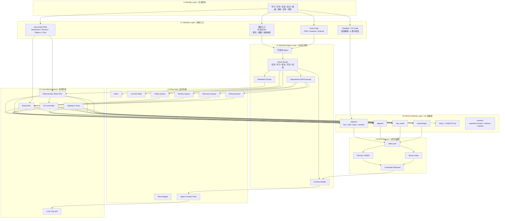

# PKOS Architecture v0.5

> Status: Draft
> Scope: Private PKOS + Flow Hub + Moonlolo Agent Integration
> Public publishing / blog flow: removed from current roadmap

## 0. Purpose

PKOS v0.5 的目标是将当前仓库从“私密知识对象系统”推进为一个可被主动 Agent 调用、可维护、可审计、可回滚的个人能动性操作系统基础设施。

v0.5 不追求完整智能化，也不追求全功能个人生产力平台。它只解决一个核心问题：

> 如何让 PKOS 的权威文件层、复习系统、Digest、私密 Dashboard，与月洛洛这样的主动交互 Agent 通过 Flow Hub 稳定耦合。

本阶段的核心成果应是：

* PKOS 保持 Git 文件权威层；
* Flow Hub 成为运行调度中枢；
* 月洛洛成为受权威层约束的主动 Agent；
* Web / future App 成为多端交互入口；
* RAG Sidecar 仅作为派生检索层预留；
* 公开博客发布链路不再属于当前架构。

---

## 1. Design Principles

### 1.1 Human Judgment First

PKOS 的最终裁决权属于人类维护者。

LLM / Agent 可以：

* 提取结构；
* 生成候选；
* 提醒；
* 总结；
* 出题；
* 调用已定义协议；
* 执行低风险写回。

LLM / Agent 不可以：

* 自行裁定事实；
* 自行迁移对象到 `trusted`；
* 自行删除权威对象；
* 自行修改治理文档；
* 自行发布内容；
* 绕过 Git 与确定性 API 写入仓库。

### 1.2 Git as Authority

权威层只承认仓库中的文件：

* Markdown；
* YAML；
* JSON；
* JSONL。

数据库、RAG index、前端导出数据、Agent context pack、运行缓存均为派生层，不是权威层。

### 1.3 Anti-Degradation First

系统设计必须避免认知退化。

自动化不得牺牲：

* 可追溯性；
* 可证伪性；
* 可回滚性；
* 证据链；
* 人类最终判断。

### 1.4 Agent Can Be Active, but Not Sovereign

月洛洛可以主动提醒、询问、推送、捕获、写入低风险日志。

但月洛洛不是新的“大他者”，也不是 PKOS 的主人。

> Agent may act.
> Agent may not rule.

### 1.5 Life Before System

PKOS v0.5 服务现实生活，不替代现实生活。

系统的终点不是更复杂的系统，而是：

* 更低摩擦地启动；
* 更可靠地复习；
* 更及时地恢复；
* 更稳定地写作；
* 更清楚地回到生活现场。

---

## 2. Removed Scope

PKOS v0.5 明确不包含公开博客发布系统。

以下模块已从当前 roadmap 删除：

* Knowledge Blog；
* WordPress；
* Argon；
* 宝塔 / CDN；
* `blog/`；
* `blog_package/`；
* `site-public/`；
* public creative route；
* HTML 发布包；
* `publish-check`；
* WordPress REST API；
* 公开发布门禁。

`creative` 类型保留，但只作为内部创作对象，不绑定公开发布流程。

---

## 3. High-Level Architecture



---

## 4. Layer Responsibilities

## 4.1 L0 Reality Layer

Reality Layer 是系统的起点与终点。

它包括：

* 学业；
* 写作；
* 项目；
* 休息；
* 恢复；
* 社交；
* 情绪波动；
* 身体信号；
* 生活事件；
* 灵感；
* 反刍；
* 拖延；
* 低能量状态。

设计原则：

> Reality is not data fuel.
> Reality is what the system serves.

---

## 4.2 L1 Interface Layer

Interface Layer 提供不同场景下的人机交互入口。

### WeChat

当前阶段的低摩擦入口。

适合：

* 主动提醒；
* 快速捕获；
* 简单状态记录；
* 任务完成反馈；
* 复习评分；
* 恢复确认；
* 短对话。

不适合：

* 复杂对象编辑；
* 大规模写入；
* 结构化 Dashboard；
* 批量整理；
* 可信迁移裁决。

### site-private Web

当前阶段的正式操作台。

适合：

* Dashboard；
* Objects 浏览；
* Queues 浏览；
* Review 操作；
* Digest 浏览；
* Chat 页面；
* Flow Hub 状态面板；
* Inbox 管理。

不承担：

* 公开发布；
* public route；
* WordPress 集成。

### Obsidian / VS Code

人类深度编辑层。

适合：

* 长文编辑；
* 对象手工维护；
* schema 调试；
* 文档修改；
* Git 操作；
* 人类最终裁决。

### Future App

未来可扩展：

* PWA；
* Desktop App；
* Android App；
* iOS App。

未来 App 只应调用统一后端契约，不应直接绕过 PKOS 后端写文件。

---

## 4.3 L2 Moonlolo Agent Layer

月洛洛是主动交互层。

职责：

* 主动提醒；
* 状态询问；
* 低摩擦捕获；
* 任务轻调度；
* 复习推送；
* 恢复建议；
* 写作启动辅助；
* Operational Skill 调用；
* 构造对话上下文；
* 通过写回路由器执行低风险写回。

月洛洛不负责：

* 自动 trusted；
* 自动删除对象；
* 自动发布内容；
* 自动修改治理文档；
* 自动决定长期人生方向；
* 将 RAG 召回材料直接当作事实。

### Internal Components

#### Intent Router

识别用户输入属于哪类意图：

* task；
* review；
* recovery；
* writing；
* capture；
* query；
* state update；
* emotional support；
* system command。

#### Operational Skill Executor

调用预定义运行协议。

示例：

* 起床协议；
* 低能量日保护；
* 取消锚定；
* 复习启动；
* 睡前降速；
* 反刍中断；
* 写作启动；
* 高峰日后降温。

#### Context Builder

构造 LLM 上下文包。

上下文应优先来自：

1. Current State；
2. Today Queue；
3. Review Queue；
4. Recovery Queue；
5. Latest Digest；
6. Relevant Operational Skills；
7. Controlled Retrieval results。

不得默认读取全库。

#### Writeback Router

根据写回权限分级决定是否允许写入。

写回必须经过：

* 类型识别；
* 权限判断；
* 白名单接口；
* Git commit；
* diff 可追踪。

---

## 4.4 L3 Flow Hub

Flow Hub 是 v0.5 的核心新增架构。

它不是知识库，也不是 Agent。它是：

> 队列生成器 + 状态汇聚器 + 策略调度器 + Agent 上下文打包器 + 写回路由中枢。

### Core Objects

Flow Hub 管理以下运行对象：

* `inbox_item`
* `state_snapshot`
* `task`
* `review_item`
* `review_log`
* `recovery_log`
* `writing_item`
* `flow_budget`
* `operational_skill`
* `agent_context_pack`

### Inbox

低摩擦捕获池。

所有不确定输入先进入 Inbox，而不是直接变成权威对象。

来源：

* 月洛洛；
* Web；
* Future App；
* 手工录入；
* 导入材料。

### Current State

记录当前运行状态：

* energy；
* mood；
* body；
* context；
* mode；
* risk；
* updated_at。

### Flow Budget

记录一段时间内的主流、次流、暂存流。

典型 flow：

* academic；
* writing；
* project；
* recovery；
* social；
* life；
* research；
* moonlolo_maintenance；
* pkos_maintenance。

### Today Queue

今日行动队列。

不等于长期 Todo 系统，只服务当前运行。

### Review Queue

由 PKOS SRS 生成。

用于 fact / skill / claim 的间隔复习。

### Recovery Queue

恢复流队列。

恢复不是奖励，而是系统持续运行所需的一级组件。

### Writing Queue

写作队列。

用于：

* 童话；
* 宣言；
* 随笔；
* 片段；
* 公众号草稿；
* 私密表达材料。

### Agent Context Pack

供月洛洛读取的压缩上下文。

典型结构：

```json
{
  "current_state": {},
  "today_queue": [],
  "review_queue": [],
  "recovery_queue": [],
  "writing_queue": [],
  "latest_digest": {},
  "operational_skills": [],
  "retrieved_objects": []
}
```

---

## 4.5 L4 Controlled Backend

后端负责受控读写。

当前技术方向：

* local FastAPI；
* 默认仅监听 `127.0.0.1`；
* 白名单写入；
* 自动 git commit；
* API 不暴露任意文件写能力。

### Read APIs

读取：

* objects；
* queues；
* digests；
* site-private data；
* runtime context；
* rendered previews。

### Deterministic Write APIs

只允许有限写回：

* review rating；
* task done / postpone；
* inbox append；
* state snapshot append；
* recovery log append；
* tags add / remove；
* limited fields update。

### LLM Chat API

提供对话能力。

限制：

* 只读上下文；
* 引用清单；
* 不得越权写入；
* 不得绕过 Writeback Router。

### Validation Tools

当前保留命令：

```bash
python -m tools.pkos validate
python -m tools.pkos gen-queue
python -m tools.pkos gen-digest
python -m tools.pkos export-site-data
python -m tools.pkos serve
```

计划新增：

```bash
python -m tools.pkos gen-flow
python -m tools.pkos export-agent-context
python -m tools.pkos export-index
```

已移除：

```bash
python -m tools.pkos publish-check
```

---

## 4.6 L5 PKOS Authority Layer

PKOS Authority Layer 是唯一权威层。

### objects/

存储对象：

* `fact`
* `skill`
* `claim`
* `creative`

可信知识轨道：

```text
fact / skill / claim
```

内部创作轨道：

```text
creative
```

### review/logs/

复习日志。

要求：

* append-only；
* 可追溯；
* 不静默改写历史记录。

### digests/

派生摘要层。

包括：

* Knowledge Digest；
* Operational Review；
* Creative Digest。

Digest 不是新事实来源。

### raw_vault/

原始材料与捕获材料。

### docs/ + AGENTS.md

治理文档。

包括：

* 项目宪法；
* 架构文档；
* 操作文档；
* Flow Hub 契约；
* Agent 权限边界；
* RAG Sidecar 设计。

### runtime/

运行时派生数据。

例如：

* exported context；
* private site JSON；
* search index；
* agent context pack。

runtime 不是权威层。

---

## 4.7 L6 RAG Sidecar

RAG Sidecar 是派生检索层，不是权威层。

原则：

* 可删除；
* 可重建；
* 不作为唯一存储；
* 每个 chunk 必须指向 source_path / object_id / status；
* 检索结果必须带对象状态。

### Retrieval Priority

检索优先级：

1. Deterministic read；
2. Metadata filter；
3. Full-text / BM25；
4. Vector retrieval；
5. Rerank / compression。

### Status-Aware Retrieval

Agent 使用检索结果时必须区分状态：

| Status     | Usage       |
| ---------- | ----------- |
| raw        | 只能说明“曾记录过”  |
| parsed     | 候选材料        |
| challenged | 未定论，需提示反对意见 |
| trusted    | 可作为较可靠知识    |
| deprecated | 默认不引用       |
| creative   | 写作材料，不当事实   |

---

## 5. Object Tracks

## 5.1 Trusted Knowledge Track

对象：

* fact；
* skill；
* claim。

状态机：

```text
raw -> parsed -> challenged -> trusted -> deprecated
```

### fact

最低 trusted 条件：

* 至少一个可靠来源；
* 标注易错点或反例；
* 适用范围明确。

### skill

最低 trusted 条件：

* 至少一次成功实践；
* 至少一个失败案例；
* 有可练习或复习的最小单位。

### claim

最低 trusted 条件：

* 至少一个强反对；
* 明确适用范围；
* 明确失效条件；
* 区分事实、推理与主观判断。

---

## 5.2 Creative Track

`creative` 是内部创作轨道。

用途：

* 童话；
* 宣言；
* 随笔；
* 灵感；
* 诗；
* 片段；
* 私密写作；
* 公众号草稿。

生命周期：

```text
draft -> revised -> archived
```

规则：

* 不进入 trusted 状态机；
* 不参与默认 SRS；
* 不强制证据链；
* 可引用知识对象；
* 不作为事实来源；
* 不绑定公开发布。

---

## 6. Write Permission Model

| Level | Type                          | Agent Auto-Write           | Examples                                                     |
| ----- | ----------------------------- | -------------------------- | ------------------------------------------------------------ |
| L0    | Read-only                     | Yes                        | read objects, queues, digests                                |
| L1    | Append-only low risk          | Yes, via deterministic API | inbox_item, state_snapshot, recovery_log, review_log         |
| L2    | Deterministic whitelist write | Requires confirmation      | task done, postpone, review rating batch, tag updates        |
| L3    | Authority change              | Human only                 | trusted migration, delete object, schema change, docs change |
| L4    | Forbidden                     | Never                      | fabricate source, auto publish, auto trusted                 |

---

## 7. Main Data Flows

## 7.1 Capture Flow

```text
Reality
-> Moonlolo / Web / App
-> Inbox
-> Flow Hub classification
-> manual processing
-> PKOS object / task / writing item / recovery log
```

## 7.2 Review Flow

```text
PKOS object with SRS
-> gen-queue
-> Review Queue
-> Moonlolo push
-> human recall
-> review rating
-> review_log append
-> SRS update
-> Git commit
```

## 7.3 Recovery Flow

```text
Current State indicates low energy / overload
-> Recovery Queue
-> Operational Skill
-> Moonlolo suggestion
-> human action
-> recovery_log append
-> Operational Review
```

## 7.4 Writing Flow

```text
fragment / idea / experience
-> Inbox or creative object
-> Writing Queue
-> draft / revised / archived
-> optional external manual publishing outside PKOS
```

PKOS 不管理公开发布。

## 7.5 Agent Context Flow

```text
PKOS Authority Layer
-> Digest / Queue / Runtime Export
-> Flow Hub
-> Agent Context Pack
-> Moonlolo
-> response / reminder / suggestion
-> controlled writeback
```

---

## 8. Directory Layout Target

Recommended v0.5 layout:

```text
PKOS/
├─ AGENTS.md
├─ README.md
├─ docs/
│  ├─ ARCHITECTURE_V0.5.md
│  ├─ FLOW_HUB_CONTRACT.md
│  ├─ AGENT_AUTHORITY_BOUNDARY.md
│  ├─ RAG_SIDECAR_DESIGN.md
│  ├─ OPERATIONS.md
│  └─ PROJECT_PLAN.md
├─ objects/
│  ├─ fact/
│  ├─ skill/
│  ├─ claim/
│  └─ creative/
├─ review/
│  └─ logs/
├─ digests/
├─ raw_vault/
├─ inbox/
├─ runtime/
│  ├─ agent_context.json
│  ├─ index.json
│  └─ site-private/
├─ site-private/
├─ tools/
│  ├─ pkos.py
│  ├─ schema/
│  ├─ site_export/
│  └─ tests/
└─ demo/
```

Not part of current architecture:

```text
blog/
blog_package/
site-public/
tools/publish_gate/
```

---

## 9. Frontend Roadmap

### Phase 1: Web Dashboard

Current target.

Features:

* objects view；
* queues view；
* review preview；
* digests view；
* private dashboard；
* no public publishing。

### Phase 2: PWA

Goal:

* mobile-friendly private dashboard；
* quick capture；
* review on phone；
* recovery logging；
* reduced dependency on WeChat。

### Phase 3: Desktop App

Possible stack:

* Tauri；
* Electron only if necessary。

Goal:

* local-first operation；
* file-aware dashboard；
* Git-aware UI；
* offline editing support。

### Phase 4: Android App

Goal:

* native notification；
* widget；
* quick capture；
* review cards；
* state snapshot；
* recovery flow。

All frontends must use controlled backend APIs.

---

## 10. Non-Goals for v0.5

v0.5 does not include:

* public blog publishing；
* WordPress integration；
* public site generation；
* autonomous Agent full control；
* trusted migration by Agent；
* full vector RAG production system；
* native Android app；
* cross-device sync；
* multi-user support；
* cloud authority database。

---

## 11. Acceptance Criteria

v0.5 architecture is considered valid when:

1. Public publishing chain remains removed.
2. `validate` passes.
3. `gen-queue` passes.
4. `gen-digest` passes.
5. `export-site-data` exports private data only.
6. `creative` exists only as internal writing object.
7. Flow Hub contract is documented.
8. Agent write permissions are documented.
9. No Agent path can migrate objects to `trusted`.
10. RAG Sidecar, if present, is status-aware and non-authoritative.
11. All write APIs are deterministic and Git-audited.
12. Private dashboard remains functional.

---

## 12. Version Roadmap

### v0.4

Completed direction:

* private dashboard；
* local backend；
* objects / review / digest；
* public publishing chain removed。

### v0.5-alpha

Target:

* Flow Hub documentation；
* Agent authority boundary；
* agent context export；
* inbox / state / task / recovery object draft；
* Moonlolo integration contract。

### v0.5-beta

Target:

* minimal Flow Hub implementation；
* Today Queue；
* Review Queue；
* Recovery Queue；
* Agent Context Pack；
* deterministic writeback APIs。

### v0.6

Target:

* RAG Sidecar；
* full-text search；
* optional vector retrieval；
* status-aware retrieval；
* controlled context injection。

### v0.7

Target:

* PWA or Desktop prototype；
* improved mobile capture；
* richer review UI；
* recovery dashboard。

### v1.0

Target:

* stable Personal Agency OS；
* PKOS authority layer；
* Flow Hub；
* Moonlolo Agent；
* private multi-end interface；
* audited writeback；
* sustainable 3–5 year maintenance path。

---

## 13. Summary

PKOS v0.5 的核心架构可以压缩为一句话：

> PKOS 是 Git 驱动的权威知识与行动记录层；Flow Hub 是任务、学习、恢复、写作的运行调度中枢；月洛洛是受权威层约束的主动 Agent；Web / future App 是多端操作入口；RAG Sidecar 是从权威层派生的可重建检索缓存；所有写回必须经过确定性 API、权限分级与 Git 审计。

本架构的目标不是让系统显得更智能，而是让系统在主动、复杂、长期演进时仍然保持：

* 可维护；
* 可审计；
* 可回滚；
* 可证伪；
* 不替代人类裁决；
* 不吞噬真实生活。
